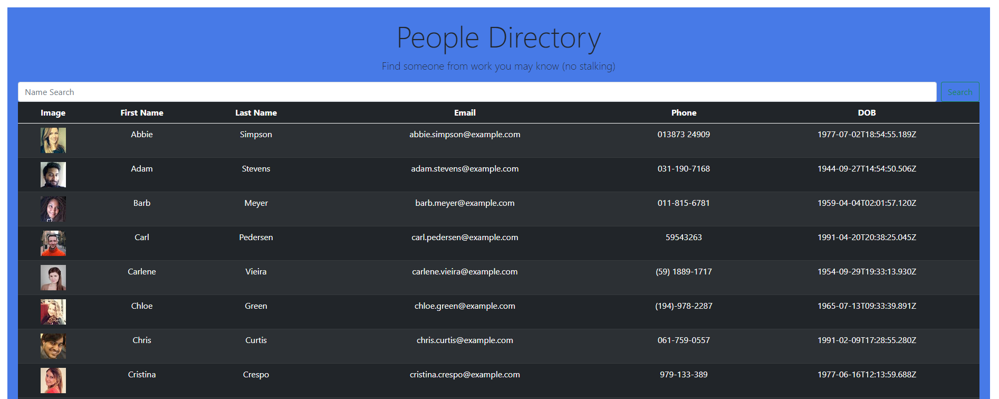

# employee_directory
employee directory using react

  ## Description
  Create an employee directory using React.js

  * [Installation](#installation)
  * [Technology](#technology)
  * [Success](#success)
  * [Holdbacks](#holdbacks)
  * [Contribution](#contribution)
  * [Test](#test)
  * [License](#license)
  * [Questions](#questions)
  

## Installation
none

## Technology
React, html, javascript, css  

## Success
React was another leap in my learning. There is a huge amount to learn but i maintained my little bits and pieces from the lessons. I was able to use the previous homework to lay the skeleton relatively quickly. Then moved onto the main parts.....

## Holdbacks
This is where the struggle began for me. the api call was the first thing i needed to get sorted out. this took probably the longest for me. It was a great deal of trial and error, watching youtube tutorials, bouncing ideas through my study group and alot of thinking. The second part was the sort function, i was very close to having this done but couldnt quite get it to work. i was able to get the bugs out with the help of our tutor and TA.

In saying this, i am still not able to get the filter to work. I have tried multiple ways and just cant seem to get it to stick. So im submitting what I have now to beable to move onto the next activities to avoid falling behind. 

## Contribution
We were given no code to begin with. Code an app was created from scratch

## Test
no testing 

## License 

## Questions
If you have fursther questions, you can reach me at
[Github](https://github.com/Jarred-Caris)
or
jarred.caris@gmail.com

[click for URL] (https://jarred-caris.github.io/employee_directory/)
